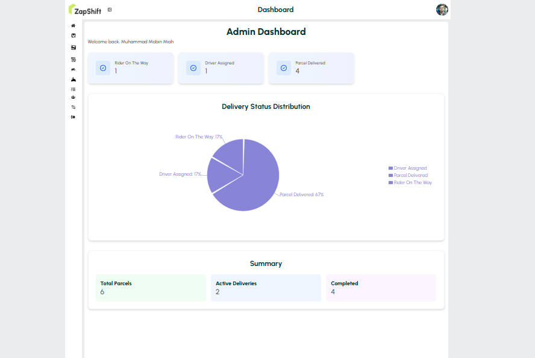
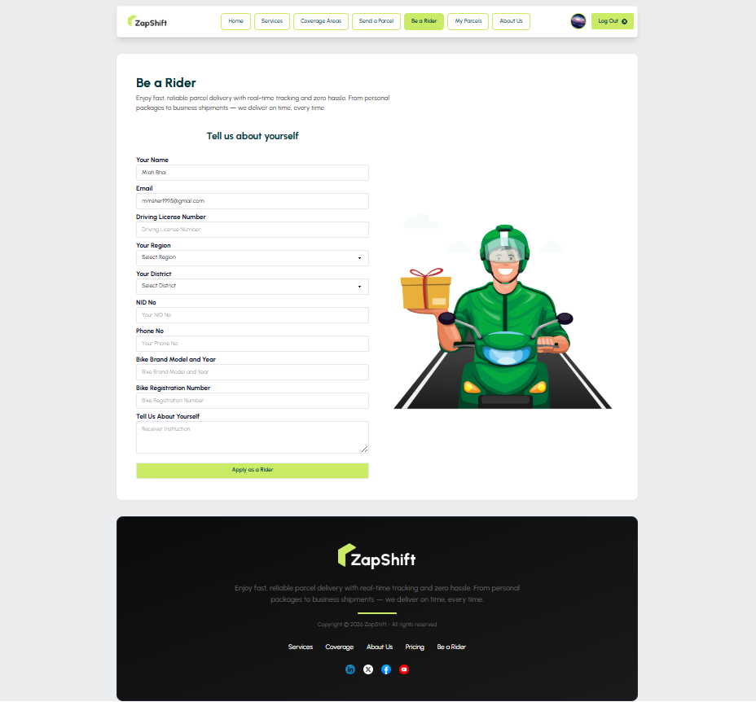
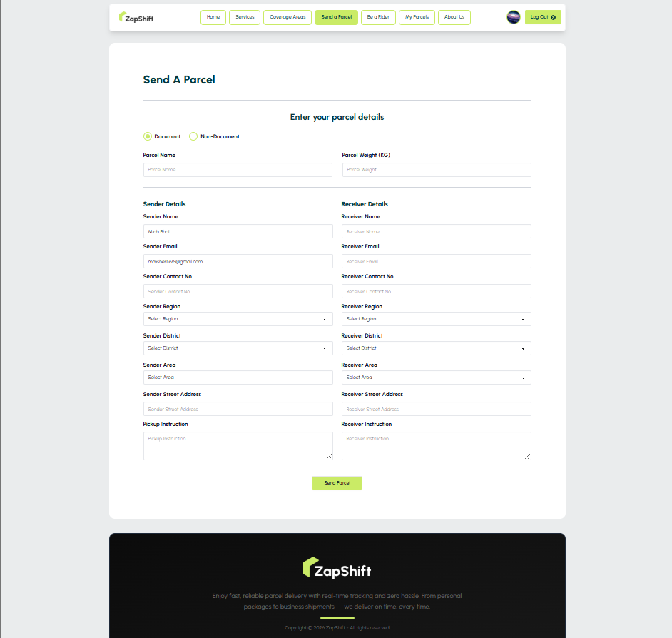
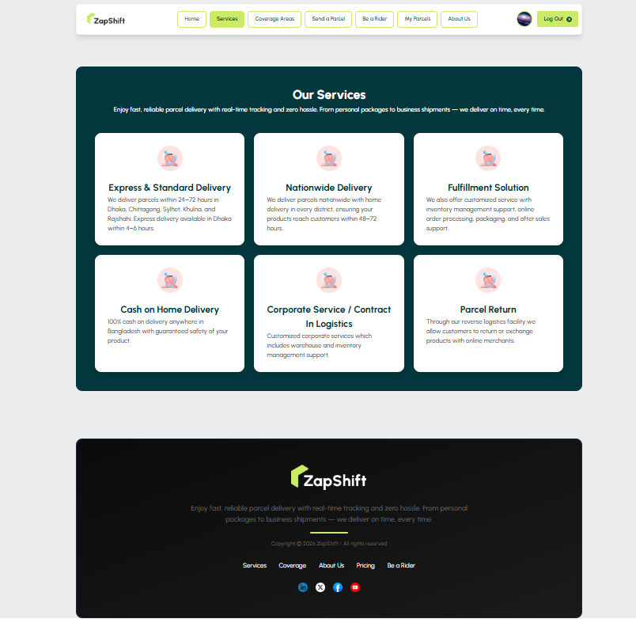
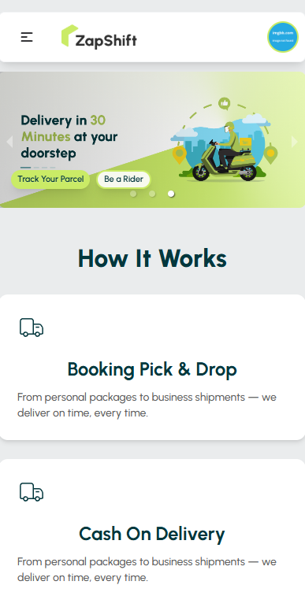
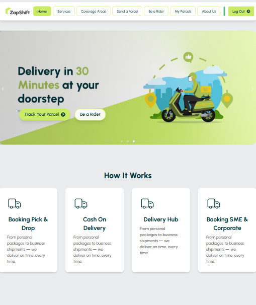
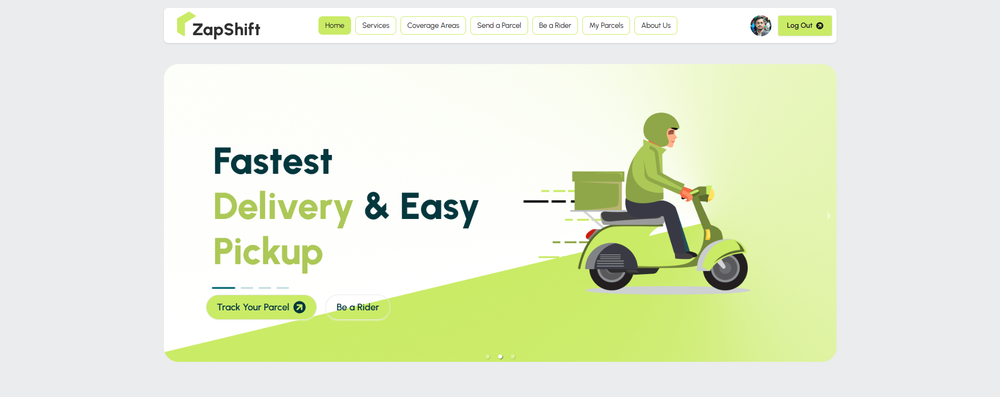
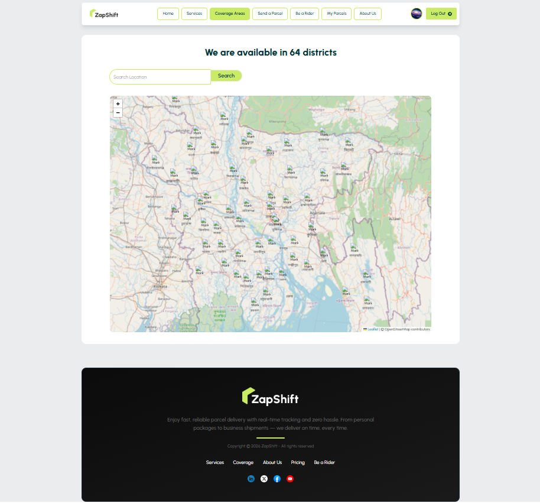

# Zap Shift Client - Frontend

Zap Shift Client is the frontend application for the parcel delivery management system. Built with React, Vite, and Tailwind CSS, it provides an intuitive user interface for sending parcels, tracking deliveries, and managing accounts.

## 🌐 Live Demo

🔗 [https://zap-shift-by-mobin.netlify.app](https://zap-shift-by-mobin.netlify.app)

## Features

- **User Authentication**: Secure login and registration with Firebase
- **Parcel Management**: Send and track parcels with real-time updates
- **Dashboard Views**: Role-based dashboards for admins, riders, and users
- **Payment Processing**: Integrated Stripe payment system
- **Responsive Design**: Mobile-first responsive interface

## Technology Stack

- **Frontend Framework**: React 18
- **Build Tool**: Vite
- **Styling**: Tailwind CSS, DaisyUI
- **State Management**: React Query, React Hooks
- **Charts**: Recharts
- **Icons**: React Icons
- **HTTP Client**: Axios
- **Authentication**: Firebase

## Dashboard Screenshots

### Admin Dashboard



The admin dashboard provides a comprehensive overview of all deliveries with statistics and visualizations showing delivery status distribution.

### Rider Dashboard


The rider dashboard displays active deliveries assigned to the rider with options to update delivery status in real-time.

### Rider Request View



View of how riders can see and accept new delivery requests assigned to them.

### User Dashboard


The user dashboard shows personal parcel history, payment records, and spending summary with easy navigation to other features.

### Send Parcel Interface



Intuitive interface for creating and sending new parcel deliveries with real-time cost calculation.

### Services Overview



Comprehensive view of available delivery services and coverage areas.

### Mobile Responsiveness



Fully responsive design that works seamlessly across all device sizes.



Optimized tablet experience with touch-friendly controls.

### Hero Section



Engaging landing page showcasing the platform's key features and benefits.

### Coverage Map



Interactive map showing service coverage areas and delivery zones.

## Installation

1. Clone the repository:

```bash
git clone https://github.com/your-username/zap-shift.git
cd zap-shift
```

2. Navigate to the client directory:

```bash
cd zap-shift-client
```

3. Install dependencies:

```bash
npm install
```

4. Set up environment variables in a `.env` file:

```
VITE_apiKey=your_firebase_api_key
VITE_authDomain=your_firebase_auth_domain
VITE_projectId=your_firebase_project_id
VITE_storageBucket=your_firebase_storage_bucket
VITE_messagingSenderId=your_firebase_sender_id
VITE_appId=your_firebase_app_id
VITE_photo_host_key=your_photo_host_key
VITE_API_BASE_URL=http://localhost:3000
```

5. Start the development server:

```bash
npm run dev
```

## Available Scripts

- `npm run dev` - Start the development server
- `npm run build` - Build the application for production
- `npm run preview` - Preview the production build locally

## Project Structure

```
src/
├── components/           # Reusable UI components
├── contexts/             # React Context providers
├── firebase/             # Firebase configuration
├── hooks/                # Custom React hooks
├── layouts/              # Page layouts
├── pages/                # Route components
│   ├── Dashboard/        # Dashboard components
│   ├── AuthPages/        # Authentication pages
│   └── ...               # Other page components
├── routes/               # Routing configuration
└── App.jsx               # Main application component
```

## Key Components

- **AuthContext**: Manages user authentication state
- **useAxiosSecure**: Handles authenticated API requests
- **useRole**: Determines user role (admin, rider, user)
- **Dashboard Components**: Role-based dashboard views
- **Loading Component**: Consistent loading state UI

## API Integration

The client communicates with the Zap Shift backend server through secure API endpoints:

- `/users/:email/role` - Get user role information
- `/parcels` - Manage parcel data
- `/payments` - Handle payment information
- `/riders` - Rider management endpoints

## Contributing

1. Fork the repository
2. Create a feature branch (`git checkout -b feature/amazing-feature`)
3. Make your changes
4. Commit your changes (`git commit -m 'Add amazing feature'`)
5. Push to the branch (`git push origin feature/amazing-feature`)
6. Open a Pull Request

## Environment Variables

The application requires the following environment variables to be set in a `.env` file:

- `VITE_apiKey`: Firebase API key
- `VITE_authDomain`: Firebase auth domain
- `VITE_projectId`: Firebase project ID
- `VITE_storageBucket`: Firebase storage bucket
- `VITE_messagingSenderId`: Firebase messaging sender ID
- `VITE_appId`: Firebase app ID
- `VITE_photo_host_key`: Photo hosting key
- `VITE_API_BASE_URL`: Backend API base URL

## License

This project is licensed under the MIT License.
